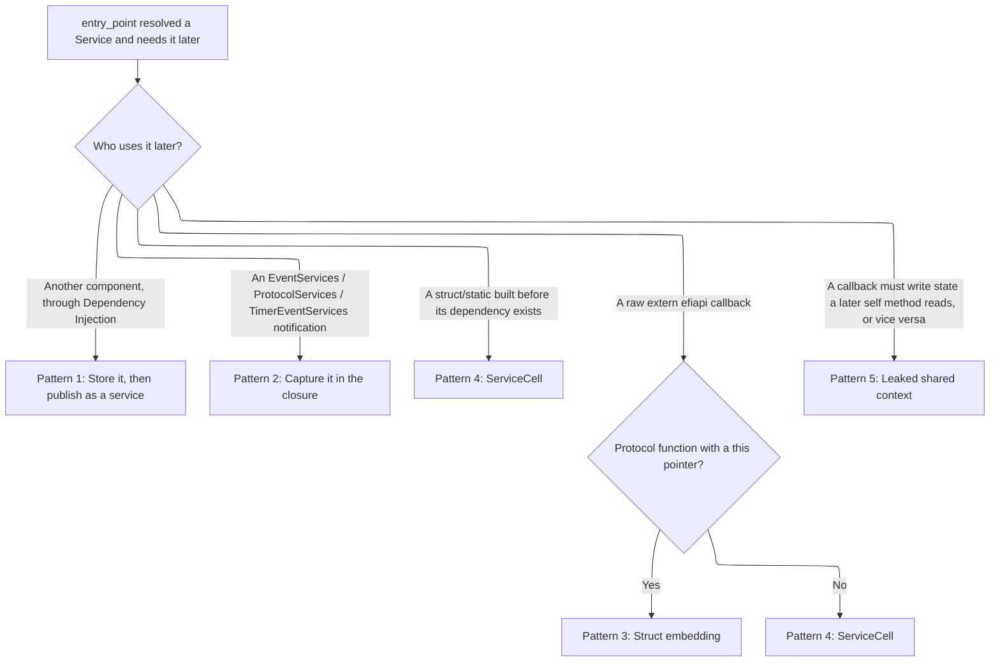

# Storing Services in Components

A component's `entry_point` function runs once. That raises a common question: how does a component hand off something
it looked up in `entry_point`, usually a `Service<T>`, to code that runs later? That later code might be another
component, an event notification, a protocol callback, or a raw `extern "efiapi"` function backing an old C protocol.

The first instinct might be to drop the value into a `static` and simple access it where needed. Patina tries to avoid
that, for a few reasons.

- Most of Patina's own state, including `Storage` and its `RefCell` backed configs, assume a single owner during
  dispatch. A `static` written from more than one place, or read from a callback running at a raised TPL, can introduce
  reentrancy and TPL inversion problems covered in [Synchronization](../dxe_core/synchronization.md).
- Dependency injection (DI) is more effective when dependencies stay explicit and typed. A `static` can be read from
  anywhere in the crate making it more likely to circumvent the safety provided by the component model and reason about
  safe access to the static.

Most patterns described here bind state to a single running instance instead, such as an allocation or a closure, which
is easier to reason about and does not linger once nothing needs it anymore. Statics are not forbidden though, and this
page serves as a guide that shows common patterns for component service storage and clarifies when statics are
appropriate.

The goal is to find the smallest pattern that solves the problem, and only fall back to a bare `static` when nothing
else works.

## Which pattern do I need?



## Pattern 1: Store it on the component, then publish the component as a service

If another component needs the value later, the normal dependency injection system can be used. By publishing a service,
the component can continue to provide functionality to later components. It stays available as that service as long as
anything holds a `Service<T>` pointing at it. So save whatever `entry_point` resolved as a plain struct field, then
publish `self`. Every later caller gets a `Service<dyn Trait>` pointing at that same instance and calls ordinary `&self`
methods on it. This assumes the struct can be constructed with the dependency already in hand. If it has to exist
earlier than that, a `const`-constructed `static`, for example, see Pattern 4 instead.

```rust,ignore
#[derive(IntoService)]
#[service(dyn MyTrait)]
pub struct MyComponent {
    dependency: Service<dyn SomeOtherService>,
}

#[component]
impl MyComponent {
    fn entry_point(mut self, dependency: Service<dyn SomeOtherService>, mut commands: Commands) -> Result<()> {
        self.dependency = dependency;
        commands.add_service(self);
        Ok(())
    }
}
```

You will see this described in the [`Service<T>`](interface.md#servicet):

> "Each component receives their own service instance... which allows them stash it for their own needs post component
> execution."

- [`MmCommunicator`](https://github.com/OpenDevicePartnership/patina/blob/main/components/patina_mm/src/component/communicator.rs)
  is an example. It stores an injected `Service<dyn SwMmiTrigger>`, publishes `Service<dyn MmCommunication>`, and later
  callers just call `.communicate()`.
- [`SwMmiManager`](https://github.com/OpenDevicePartnership/patina/blob/main/components/patina_mm/src/component/sw_mmi_manager.rs)
  (in the same crate) has a simpler version of this. It only stores a config value and needs no leak at all.

## Pattern 2: Capture it in the closure

This covers a scenario common when using Patina UEFI Services. A component sets up an event or protocol notification,
and the callback needs something the entry point already resolved. `EventServicesExt::on_event`/ `on_event_group`,
`ProtocolServicesExt::on_protocol_installed`, and `TimerEventServicesExt::on_timer_event` all take a regular closure,
`impl FnMut(..) + 'static`. The DXE Core boxes it and keeps it alive for as long as the registration lasts, so there is
no global to write anywhere. Just `move` the `Service<T>` the callback needed straight into the closure.

```rust,ignore
fn entry_point(
    events: Service<dyn EventServices>,
    protocols: Service<dyn ProtocolServices>,
) -> Result<()> {
    events.on_event(Tpl::Callback, move || {
        // `protocols` (or any other `Service<T>`, or any `Clone` plus `'static` value) is available
        // here because it was moved into the closure, not because it was looked up again.
        let _ = &protocols;
    })?;
    Ok(())
}
```

```admonish note
Callbacks registered this way never get a `&Storage` on purpose. `Storage` assumes one owner at a time,
and structural changes go through `Commands`. Handing it to a callback that might run at a
raised TPL brings back the same risk a `static` would, and it would let a callback quietly exercise services it never
declared as a dependency. Capturing the `Service<T>` you already resolved is simpler and just as available. `patina_test`'s test
scheduler accesses `Storage` from inside a callback because it has to run arbitrary test functions defined elsewhere, each with its own parameter list,
much like how the dispatcher runs a component. It does this through a raw pointer and an `unsafe` block with a written
justification, but it's not meant to be a pattern for general use.
```

- [`comm_buffer_update.rs`](https://github.com/OpenDevicePartnership/patina/blob/main/components/patina_mm/src/component/communicator/comm_buffer_update.rs)
  has an example that captures a cloned `Service<dyn ProtocolServices>` this way.
- `patina_performance`'s
  [`FbptPublisher`](https://github.com/OpenDevicePartnership/patina/blob/main/components/patina_performance/src/component/fbpt.rs)
  and `MmRecordCollector` show that a closure can even carry its own small bit of state directly. Each wraps a
  `Cell<bool>` so it only acts the first time its event group fires. No static or leak needed, since nothing outside the
  closure ever looks at that flag.

```admonish warning
A captured `Service<T>` is always safe to hold onto. Calling back into it from inside the callback is a separate
question. If that service uses a `TplMutex` set below the callback's own `notify_tpl`, the call panics, because
raising the TPL the wrong way is treated as an error rather than something to queue or retry. This has nothing to do
with how the value was stored, so check the TPL requirements of anything a notification calls, captured or not.
```

## Pattern 3: Struct embedding

If the component owns the protocol struct's allocation, and the callback gets a pointer back to it (many EDK II
protocols pass a `This` pointer), a static can be avoided completely.

Allocate one struct with the protocol as its first `#[repr(C)]` field, followed by any extra state that is needed, leak
it once with `Box::into_raw` or `Box::leak`, and cast the callback's incoming pointer back to the wrapper type.

- [`patina_smbios`'s protocol module](https://github.com/OpenDevicePartnership/patina/blob/main/components/patina_smbios/src/manager/protocol.rs)
  has an example.
- `patina_adv_logger` does the same thing for its own logging protocol.

Use this only when the protocol definition supports it. Do not force it onto a protocol with no pointer back to itself.
This alternative only applies to the callback case. A struct or static that must exist before its dependency does has no
equivalent trick, `ServiceCell` is the only option there.

## Pattern 4: Bridge to code or storage outside direct dependency injection

Some C protocols define a function pointer with no `this` or context argument at all, the signature is fixed by the
protocol, so a closure has nowhere to attach. Some structs and statics have the opposite problem: they have to exist
before the dependency injection system does, often built with a `const fn` constructor so they can be a top-level
`static`, so their dependency can only arrive later, once some component's entry point resolves it. Either way, another
type is needed.

**The type for this case is
[`ServiceCell<T>`](https://github.com/OpenDevicePartnership/patina/blob/main/sdk/patina/src/component/service/cell.rs).**
It is a small `static` cell made for this problem. The entry point (or an init method it calls) publishes the resolved
value once, and the callback or struct reads it back later through `get()`. It never blocks and it can only be written
once. See its module documentation for the full safety reasoning.

```rust,ignore
static PROTOCOL_SERVICE: ServiceCell<Service<dyn MyService>> = ServiceCell::new();

unsafe extern "efiapi" fn c_callback(/* fixed signature, no context param */) -> efi::Status {
    let Some(service) = PROTOCOL_SERVICE.get() else { return efi::Status::NOT_READY };
    // use `service`
    efi::Status::SUCCESS
}
```

- [`patina_performance`'s protocol bridge](https://github.com/OpenDevicePartnership/patina/blob/main/components/patina_performance/src/component/protocol.rs)
  has a version of the callback case, bridging `EdkiiPerformanceMeasurementProtocol`'s single function pointer, which
  carries no context, to an injected `Service<dyn PerformanceManager>`.

- For the struct case,
  [`AdvancedLogger`](https://github.com/OpenDevicePartnership/patina/blob/main/components/patina_adv_logger/src/logger.rs)
  holds its `Service<dyn ArchTimerFunctionality>` in a `ServiceCell` field because it is built as a `static` before the
  component model exists, and an `init_timer` method publishes the real service once some component's entry point
  resolves it.
  - `patina_dxe_core`'s `CORE_PERFORMANCE` static does the same thing.

Sometimes a static like this is the only option.

- For example, in
  [`patina_acpi`](https://github.com/OpenDevicePartnership/patina/blob/main/components/patina_acpi/src/acpi_protocol.rs)'s
  `AcpiGetProtocol`, none of its functions get a pointer back to the protocol at all, so there is nothing to embed a
  reference into. A shared static is the only way those callbacks can reach the rest of the ACPI state.

## Pattern 5: Let a callback and a later method share state

Sometimes a callback needs to write something that a later `&self` method on the same component has to read, or the
other way round. This is not just capturing a value once and using it. Both sides need to see changes as they happen. In
these cases, it is possible to `Box::leak` a small context struct with something like a `Cell`, `AtomicBool`, or
`AtomicPtr` inside, then give both the closure and a field on the component a `&'static` reference to it.

```rust,ignore
struct SharedContext {
    pending: AtomicBool,
}

// entry_point:
let context: &'static SharedContext = Box::leak(Box::new(SharedContext { pending: AtomicBool::new(false) }));
self.context = Some(context); // stored on the component for a later &self method to read
protocols.on_protocol_installed::<P>(Tpl::Callback, move |_handle| {
    context.pending.store(true, Ordering::Release);
})?;
```

This is a normal box heap allocation made once while the component runs, not a `static` in the file.

- [`ProtocolNotifyContext`](https://github.com/OpenDevicePartnership/patina/blob/main/components/patina_mm/src/component/communicator/comm_buffer_update.rs)
  has an example.

- `patina_test` uses the same approach. Its `on_event_group_once` helper leaks a `Cell<Option<Event>>` so a callback can
  close its own registration the first time it runs, then never has to fire that cleanup again.

## Summary

<!-- markdownlint-disable -->

| Later caller is...                                                                                             | Use                                                        |
| -------------------------------------------------------------------------------------------------------------- | ---------------------------------------------------------- |
| Another component, through Dependency Injection                                                                | Pattern 1, store it and publish the component as a service |
| An `EventServices`, `ProtocolServices`, or `TimerEventServices` notification                                   | Pattern 2, capture it with `move` in the closure           |
| A raw `extern "efiapi"` callback with a `this` pointer to the protocol struct itself                           | Pattern 3, embed the protocol struct in a wrapper struct   |
| A raw `extern "efiapi"` callback with no `this` pointer, or a struct/static built before its dependency exists | Pattern 4, `ServiceCell<T>`                                |
| A callback and a later method both need to see shared state                                                    | Pattern 5, a leaked context with interior mutability       |

<!-- markdownlint-enable -->

In short, avoid a bare mutable `static` unless none of the four patterns above fit.
