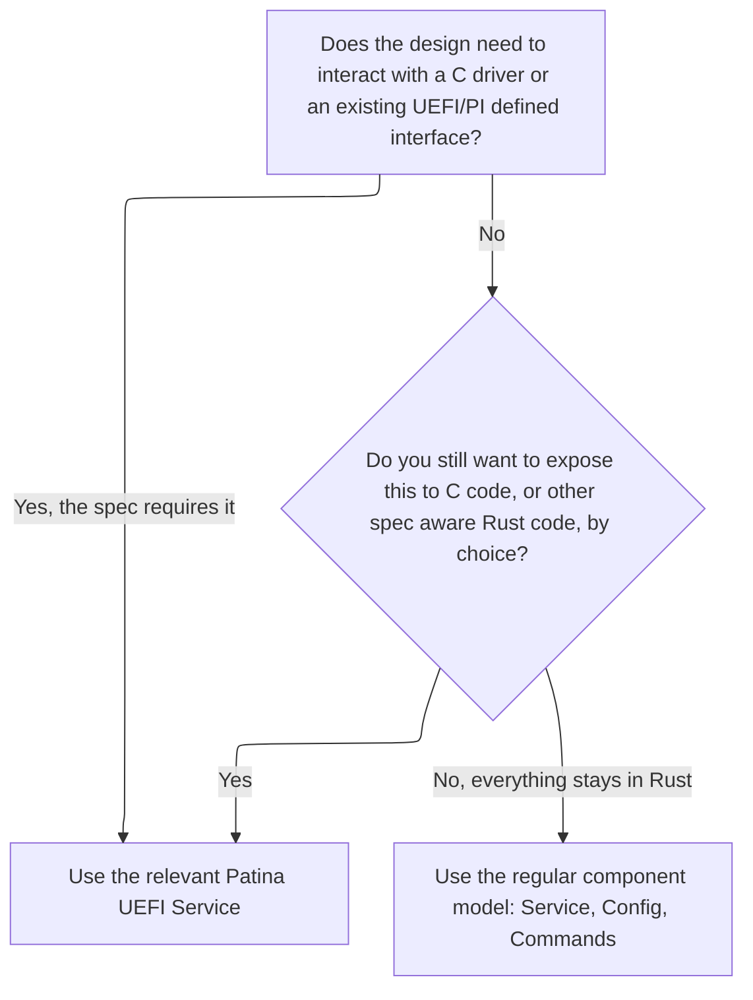

# Patina UEFI Services

Patina UEFI Services are defined in
[`patina::component::service::uefi_services`](https://github.com/OpenDevicePartnership/patina/tree/main/sdk/patina/src/component/service/uefi_services).

They give components an idiomatic Rust way to use the services defined in the UEFI Specification, mainly Boot Services
and, over time, Runtime Services. The same pattern also covers other specification defined interfaces a component might
need, such as DXE Services from the Platform Initialization (PI) Specification.

This page does not document what each service does. See [Component Interface](interface.md#uefi-services) for that, or
go straight to a service's reference in the [Summary](#summary) below. This page is about when a component should use
UEFI Services.

## What they are for

If you already know your design mandates cooperation with C drivers or must fulfill certain requirements, such as
registering for an event, installing a protocol, or connecting a controller, Patina UEFI Services are the answer for
doing the same thing in a Patina component. They give you an obvious, idiomatic interface for a specification defined
operation, a `Result` instead of an `EFI_STATUS`, a closure instead of a raw notify function pointer, a typed protocol
reference instead of a `*mut c_void`. They answer one question, how do you do what you used to do in C, in a Rust
component.

They do not change what the operation means on the specification side, though. Installing a protocol through
`ProtocolServices` still puts a real protocol into the global UEFI handle database, where any C driver can find and open
it. An `EventServices` callback still runs at whatever TPL the specification requires for that event type. That
interoperability is both the point and potential danger of UEFI Services. While Patina improves safety at the component
interface level, it does not change the nature of those operations. Because of that, Patina UEFI Services are always
bound to their C-oriented specification, and should be used only when a design requires that touchpoint, not as a
general way for two Patina components to talk to each other.

## When a design requires them

These are examples of when a design might call for UEFI Services:

- A C driver signals a notification a component cares about, an event group like End of DXE or Ready To Boot, for
  example. Registering a callback in the event database, through `EventServices`, is the only way to find out.
- A component needs to publish a protocol that C drivers, or other UEFI aware code, expect to find. Installing it
  through `ProtocolServices` is not optional once that requirement exists.
- Locating a controller and connecting a driver to it is part of the UEFI driver model, which lives at the protocol and
  handle level. That is what `DriverServices` is for.

In each case, the problem itself requires the service.

## When a design chooses them

Other times, nothing forces the decision. A component could keep a piece of functionality entirely inside the Patina
component model, behind an ordinary `Service<T>`, but instead chooses to publish it as a UEFI protocol or event so that
C code, or other Rust code that only knows the specification defined interface, can use it too. This is a reasonable
choice when broader reuse is valuable. In those cases, it may also be possible to publish a complementary Patina
service, so that other Patina components can use the same functionality without going through the UEFI interface. That
option will vary in usefulness and safety depending on the design.

```admonish note
Publishing through a UEFI Service means giving something up. Whatever you install or store will reside
outside of Rust's ownership model, exposed and shared with C code through global, specification defined structures
like the handle database or an event's callback list. The compiler can no longer track who owns it or when it is
safe to change.
```

## When you do not need them

If a design is Rust from top to bottom, with nothing that has to be exposed to or consumed from C code and there are no
pre-existing specification obligations (such as protocol requirements) to fulfill, skip Patina UEFI Services may not be
needed. Two Patina components can share functionality and control dispatch order using the regular component model
instead, a `Service<T>` for shared functionality, `Config<T>` or `ConfigMut<T>` for shared configuration, and `Commands`
to register either one. None of that needs to go through a UEFI protocol, event, or table. It is simpler, it keeps
everything inside Rust's ownership model, and dependency injection already handles ordering for you.



## Summary

Patina UEFI Services are grouped by function, so a component can depend on only the piece it actually uses. Each one is
a normal `Service<T>` parameter, consumed the same way as any other service.

<!-- markdownlint-disable -->

| Service                      | Covers                                                    | Reference                             |
| ---------------------------- | --------------------------------------------------------- | ------------------------------------- |
| `ConfigurationTableServices` | Installing and looking up UEFI configuration tables       | [docs.rs][ConfigurationTableServices] |
| `DriverServices`             | Connecting and disconnecting drivers and controllers      | [docs.rs][DriverServices]             |
| `EventServices`              | Creating events and registering closures as notifications | [docs.rs][EventServices]              |
| `ImageServices`              | Loading, starting, and unloading UEFI images              | [docs.rs][ImageServices]              |
| `MiscServices`               | Small utilities, such as CRC-32 calculation               | [docs.rs][MiscServices]               |
| `ProtocolServices`           | Installing, locating, and opening protocols               | [docs.rs][ProtocolServices]           |
| `TimerEventServices`         | Scheduling timer events, once or on a repeating interval  | [docs.rs][TimerEventServices]         |
| `TimingServices`             | Stalling and the watchdog timer                           | [docs.rs][TimingServices]             |
| `TplServices`                | Raising and restoring Task Priority Level                 | [docs.rs][TplServices]                |

<!-- markdownlint-enable -->

[ConfigurationTableServices]:
  https://docs.rs/patina/latest/patina/component/service/uefi_services/config_table/trait.ConfigurationTableServices.html
[DriverServices]: https://docs.rs/patina/latest/patina/component/service/uefi_services/driver/trait.DriverServices.html
[EventServices]: https://docs.rs/patina/latest/patina/component/service/uefi_services/event/trait.EventServices.html
[ImageServices]: https://docs.rs/patina/latest/patina/component/service/uefi_services/image/trait.ImageServices.html
[MiscServices]: https://docs.rs/patina/latest/patina/component/service/uefi_services/misc/trait.MiscServices.html
[ProtocolServices]:
  https://docs.rs/patina/latest/patina/component/service/uefi_services/protocol/trait.ProtocolServices.html
[TimerEventServices]:
  https://docs.rs/patina/latest/patina/component/service/uefi_services/timer_event/trait.TimerEventServices.html
[TimingServices]: https://docs.rs/patina/latest/patina/component/service/uefi_services/timing/trait.TimingServices.html
[TplServices]: https://docs.rs/patina/latest/patina/component/service/uefi_services/tpl/trait.TplServices.html
