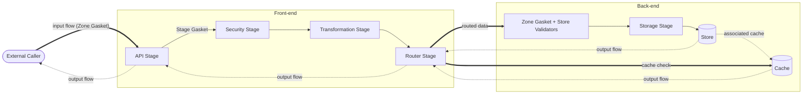
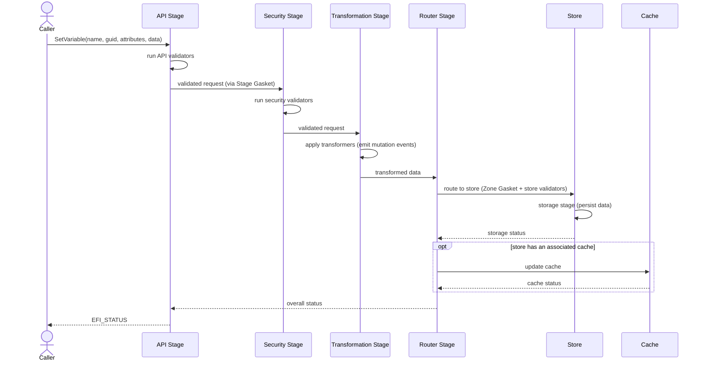
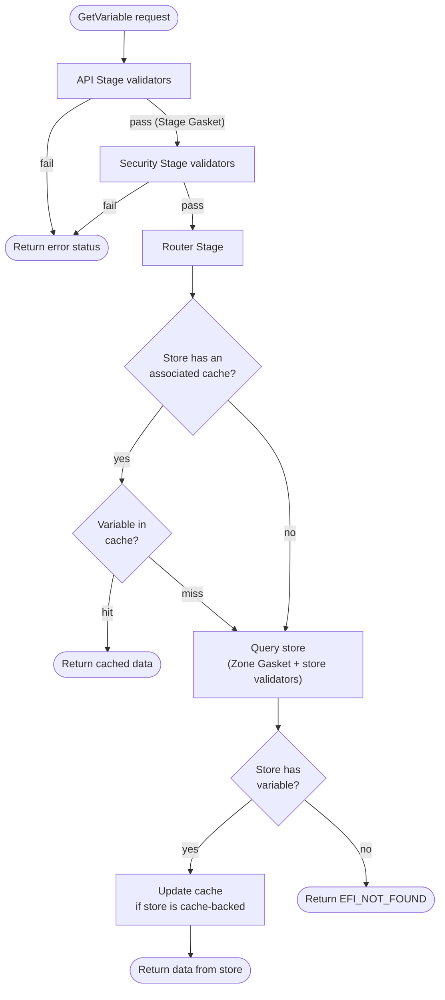

# Patina UEFI Variable Design

## Introduction

This document describes the Patina UEFI variable design. This design is meant to be extensible and easy to test.

As a result, the design involves a stronger use of interfaces and other software constructs than typically defined
in firmware drivers (and today's EDK II UEFI variable stack). Such separation supports:

- Better portability and cooperation of separate design parts across language boundaries
- Increased extensibility to introduce new design elements and extend instances of presently defined elements
- Isolated testing of individual parts of the design

To establish a lexicon used to identify individual entities that compose the overall variable design, a set of primary
design pieces are defined below and referenced throughout the remainder of the document and source repository.

## Zones

Zones are regions of the overall design in which residing elements share a common high-level responsibility and are
completely decoupled from other design areas. Control only transfers between zones across well-defined APIs. All data
transferred across zones is considered external and untrusted.

- `External` - Code outside the front-end and back-end.
  - All interaction with variable services occurs through externally defined interfaces.
- `Front-end` - Performs data validation and business logic. When data leaves the front-end, it has been validated
  and transformed to its final state for transfer to the back-end.
- `Back-end` - Handles moving data between the front-end and data destinations.

Every zone depends on a `Zone Gasket` to receive data from the zone before it, with the exception of the `External`
zone, which is the first zone data enters, has no zone before it, and therefore has no `Zone Gasket`
(see [Gasket](#gasket)).

## Flows

The variable software stack moves data from an external caller to a store and from a store back to an external caller.

The direction of data movement from caller to store is called `input flow` and the movement back to the caller is
called `output flow`.

Some elements may perform the same actions regardless of flow. In other cases, flow will completely change how the
component behaves.

## Stages

As data progress within a zone, it is passed between `stages`. A stage is a container of `elements`. The duration of
execution for each element within the stage is called the element's `time`.

For example, in the `API stage`, three `validator` element instances might be present. During the stage, the three
validators are sequentially run against the variable data. The duration of time those three validators are running is
called the `API stage validation time`.

## Elements

As variable data moves in flows between zones, it is passes through stages which contain `elements`. The different
types of allowed elements are defined in this section.

### API

An `API` is a well-defined and stable interface.

### Cache

A `cache` is a special type of `store` with a pre-configured store policy to always serve as a volatile memory store
with _cache-like_ properties.

Each store may optionally have an associated cache.

A store with an associated cache should prime that cache (populate it from the store) during initialization, so
reads can be served from the cache without relying upon the underlying store. In case of a cache miss, a read policy
may be configured to either fall through to the store via a read request or return a not found error. In most cases,
it is recommended to prime the cache to avoid potential performance penalties resulting from cache misses. In any case,
an associate cache must be coherent with its store, so a write to the store must also update the cache, and the cache
must accurately reflect the store's contents at all times.

### Gasket

A `gasket` is a data bridge that connects one design piece to another. A gasket does not modify the actual variable
data (that is what a `transformer` does). Instead, it modifies the _presentation_ of the data for compatibility
between the pieces it connects.

Gaskets are defined at three scopes, matching the granularity of the design pieces they connect, from broadest to
narrowest:

- `Zone Gasket` - Bridges data between two `zones`.
- `Stage Gasket` - Bridges data between two `stages` within the same zone.
- `Element Gasket` - Bridges data between two `elements` within the same stage.

A `zone`, `stage`, or `element` depends on exactly one gasket, chosen from a gasket defined at its own scope or a
any broader scope. It may never depend on a gasket defined at a narrower scope than itself:

- A `zone` may depend only on a `Zone Gasket`.
- A `stage` may depend on a `Stage Gasket` or a `Zone Gasket`.
- An `element` may depend on an `Element Gasket`, a `Stage Gasket`, or a `Zone Gasket`.

This lets a broader-scope gasket satisfy the bridging needs of everything nested within it, while still allowing a
narrower design piece to define its own gasket when it needs presentation compatibility the enclosing scope's
gasket does not already provide. A `Gasket Validator` is what confirms a chosen gasket, at whatever scope, actually
satisfies the requirements of the design piece depending on it.

A gasket dependency is required at every level except `zone`. Every `stage` and every `element` must specify one.

Every `zone` depends on a `Zone Gasket`, with one exception, the first zone (see [Zones](#zones)), which has no zone
before it and therefore has no `Zone Gasket`.

Because a `Zone Gasket` sits at boundaries, it carries a responsibility beyond presentation compatibility, it must
produce a copy of or move data into the destination zone so it becomes the exclusive owner of the data before any
further processing, including validation, occurs. No stage or element may retain a reference to memory owned by another
zone. This applies even when the destination zone is a `Trusted Execution Environment`, since the origin zone must be
assumed to execute concurrently with, and independently of, the destination zone.

### Hook

A `hook` is simply a notification to subscribers that a `hook event` has occurred.

The following hook events are defined:

1. `Mutation Event` - An event issued before and after transformers operate on data.
2. `Status Event` - An event issued when external status data is produced.
3. `Validation Event` - An event issued at validation time in an input flow.

Hooks are required to be registered when the variable driver is initialized, and may not be registered or unregistered
at any other time.

Each hook invocation is bounded by either a timeout or execution budget so a slow or unresponsive subscriber cannot
stall the transaction that triggered it, and the data included in an event is limited to what that specific subscriber
is authorized to see.

### Logger

A `logger` is a data sink for _types_ of operational messages and status.

Examples of loggers include:

- Debug output
- Tracing output
- Telemetry output

### Policy

`Policy` is an instantiation of data configuration for an element and the central method of defining data properties of
elements.

- `Policy Data` describes how an element should be configured
- `Policy Schema` describes how `Policy Data` should be organized

Many elements have policy to describe how they should operate. For example:

- `Hook Policy`
  - Configures hook parameters
- `Logger Policy`
  - Configures logging parameters
- `Router Policy`
  - Maps each variable to a store
- `Rule Validator Policy`
  - Configures whether access rules may be changed after initialization
- `Store Policy`
  - Configures store properties
- `Transformer Policy`
  - Configures transformation parameters
- `Validator Policy`
  - Configures validator parameters

> Note that this generic `policy` concept is distinct from the EDK II UEFI Variable Policy feature, which restricts
> how a specific variable may subsequently be written (for example, locking it, or constraining its size and
> attributes) and is itself an external-facing capability rather than internal element configuration. In this design,
> an equivalent enforcement is realized as policy data consumed by a `Validator` (most likely an `API Validator` or
> `Security Validator`) in this design, not as a new kind of element.

A `Rule` is this policy data. It restricts a single variable or a whole namespace to a minimum and/or maximum size,
attributes that must or must not be present, and whether the variable may still be written, read, or ever receive
another rule (a `write lock`, `read lock`, and `rule lock`, respectively). `Rule lock` defaults on, so a rule that
does not explicitly disable it permanently prevents any further rule from being registered for whatever it covers.
Rules are grouped into a `Ruleset`, at least one `Rule` per variable or namespace that has coverage, and when more
than one rule covers the same variable, their restrictions are combined so the result is always at least as strict
as every individual rule, never less strict.

A variable may not be written or deleted at all if no rule covers it yet, unless a rule is provided at the same
time, either already registered or attached to the request itself. `Rule Validator Policy`, set at initialization,
decides whether providing a rule at any time other than initialization is permitted at all.

### Router

The `router` transfers data between the `front-end` and `back-end` of the variable design. This means the router maps
individual variable transactions that have finished being processed by the front-end to a store on the back-end.
`Router Policy` maps each variable to exactly one store. A variable is never mapped to more than one store. If
`Router Policy` does not resolve a variable to a store, the router must reject the transaction rather than silently
discarding the variable or falling back to an misconfigured default store.

### Store

A `store` is an instance of a variable data destination. _N_ instances of stores may exist in the system, though each
variable is mapped to exactly one store (see [Router](#router)).

Two general types of stores exist:

- `Concrete` - Directly manages the storage of the variable data on an underlying hardware storage device.
- `Proxy` - Proxies the data to another entity that ultimately stores the data in its final location.

Examples of concrete stores include:

- `Firmware Volume Block Storage`
  - A Firmware Volume Block device is often used as an abstraction within Platform Initialization (PI) firmware to
    a memory-mapped device such as SPI NOR flash. This is the primary storage path for most PCs today.
- `eMMC`
  - An Embedded Multi-Media Card (eMMC) NAND flash device.
  - Data is often stored on the Replay Protected Memory Block (RPMB) partition.
- `UFS`
  - A Universal Flash Storage (UFS) NAND flash device.
  - Data is often stored on the Replay Protected Memory Block (RPMB) LUN.

Examples of proxy stores include:

- `File System`
  - The store manages the data through a store chosen file system API.
  - The file system abstracts the underlying media type.
- `Network`
  - The store manages the data through a store chosen network interface.
- `Offload Engine`
  - The store moves data back and forth between a separate micro-controller such as a Baseboard Management Controller
    (BMC).

Because the physical characteristics of underlying storage vary widely, each store is responsible for ensuring a
write is never left in a partially applied state if execution is interrupted (for example, by a power loss), using
whatever mechanism is appropriate for its own underlying media. This document intentionally does not prescribe a
specific mechanism, since the right approach depends on the store's hardware capabilities.

`Store Policy` must be able to constrain how much space a variable, or a group of variables, may consume in a given
store, so no single caller can exhaust a store's capacity. Each store must also keep enough space in reserve, or
otherwise guarantee capacity, so that delete operations always succeed, so a full store can still be recovered from
by deleting variables rather than becoming permanently stuck.

A store's on-disk format, and the schema for its `Store Policy`, should include a version identifier so a firmware
update that changes either can detect an older format and migrate it, rather than requiring the store to be
re-initialized, and its data lost, whenever its format changes.

### Transformer

A `transformer` modifies variable data in transit in an `input flow` or `output flow` throughout the variable process.

Examples of transformers include:

- `Compressors` - Compress and decompress variable data.
- `Encryptors` - Encrypt and decrypt variable data.
- `Integrity Checkers` - Compute and verify a checksum or hash to detect data corruption, independent of any
  cryptographic authentication applied to the variable.

The order in which transformers execute must be deterministic and explicitly defined by `Transformer Policy` as an
ordered sequence, not an unordered set, and the `output flow` must apply the same transformers in exactly the
reverse order used by the `input flow`. Ordering is also a correctness concern beyond agreement between writer and
reader. For example, compressing data after it has already been encrypted is generally ineffective, since encrypted
data does not compress well.

### Trusted Execution Environments

A `Trusted Execution Environment (TEE)`, within the context of this design, is a secure processing area that can be
used to perform security-sensitive operations.

Example of TEEs include:

- ARM TrustZone
- x86 System Management Mode (SMM)

### Validator

A `validator` is responsible for verifying data against a well-defined set of requirements. Validators accept data as
input and return a "validation result" value as output indicating whether the data met the validator's requirements.

A validator must be free of side effects and a validator must never mutate variable data, policy, or any
other element's state, regardless of whether it returns success or failure. This allows a `validation stage` to
evaluate its validators in any order, or to short-circuit on the first failure, without changing the outcome.
Whether a given `validation stage` short-circuits on first failure or evaluates every validator and aggregates all
failures is a `Validator Policy` decision, the latter is useful for diagnostics but changes the stage's timing
characteristics.

Examples of validators include:

- `API Validator` - Verifies API requirements are met.
- `Gasket Validator` - Verifies gasket requirements are met.
- `Security Validator` - Verifies variable security requirements are met.
- `Store Validator` - Verifies store requirements are met.
- `Transformer Validator` - Verifies transformation requirements are met.

A `Security Validator` that authenticates a variable update, for example by verifying a cryptographic signature,
and needs to reject replayed updates, must treat its anti-replay state (such as a monotonic counter or timestamp)
as protected data. The state must be stored where the caller cannot roll it back, and the read-compare-then-update
of that state against an incoming request must be a single atomic operation with respect to concurrent or reentrant
calls (see [Concurrency and Reentrancy](#concurrency-and-reentrancy)).

A `Security Validator` enforcing access rules (see [Policy](#policy)) is a second case of protected state. Whether a
variable may be read, written, or deleted depends on the `Rule`s already registered for it, and registering another
one is itself a mutation that must be checked against that identifier or namespace's `rule lock` and applied
atomically, for the same reason as the anti-replay case above. A variable with no rule coverage at all may not be
written or deleted, regardless of any other validator's outcome.

## Variable Driver Theory of Operation

The variable driver accepts `variable data` as input and returns variable data as output. Variable data travels through
the driver stack in input and output `flows` between `zones`. Within zones, variable data is passed between `stages`
that contain `elements`. Elements are configured with `policy`. All active instances of an element are executed during
that element's `time` in the stage. Variable policy is platform-instantiated data that is validated against a
well-defined layout in a policy `schema`.

Throughout any flow, there are common behaviors to be aware of:

- `Loggers` output contextual information such as debug output, detailed tracing messages, telemetry data, and so on
  constantly as flows progress.
- `Stages` are composed of _N_ instances of elements for the stage type.
  - For example, a `validation stage` has _N_ validators invoked that are registered for that stage type.
- `Trusted Execution Environments (TEEs)` may be called to perform an operation within any stage. Invocation is
  specific to an element instance within a given stage and is not called out in this generic section.
  - For example, a `validator` may call into a TEE to perform authentication of an external caller.
  - A `hook` may call into a TEE to broadcast an event that has occurred during variable processing.
- `Validation Stages` only succeed if all validators within the stage return success.
  - If any validator returns failure, the variable transaction is aborted.
  - Each validation stage triggers a `validation hook event` that allows external validators to participate in that
    stage.

The diagram below shows how the zones, stages, and elements described above relate to each other, and the general
shape of the input and output flows referenced throughout this document. Thick arrows represent `input flow`
(request) movement and dotted arrows represent `output flow` (response) movement:

### Initialization Operation

First and foremost, this design is forward-looking and prioritizes extensibility and safety native to the Rust
programming language. However, for practical broad adoption, the design also supports fulfilling UEFI variables services
as defined in the UEFI Specification Runtime Services Table with the ability to build and produce the driver as a
standalone UEFI variable driver binary(s).

There are two aspects to the external interface exposed by this driver that are independent from each other:

- **Semantics**: The semantics of the `external API` that is exposed to external callers and is the primary interface
  for variable services. This does not mean whether the API is a C-style or Rust-style interface, but that the actual
  semantics of the API are entirely different for UEFI variable operations. This is, by definition, incompatible with
  the UEFI variable service APIs defined in the UEFI Specification today (as of the UEFI Specification 2.11 release).
  For example, a "safer" `SetVariable` API may require UEFI variable policy to be defined and validated before allowing
  the variable to be set (not optionally after the fact). This requirement is language agnostic and improves variable
  safety independent of whether the interface is provided to C or Rust callers.

- **Invocation Mechanism**: Individual functions and the types they operate on may be constrained to strict UEFI
  Specification adherence or not. For example, a `SetVariable` API intended for placement in the UEFI Runtime Services
  Table must use the C ABI and exactly follow the UEFI Specification defined function signature. However, a native Rust
  API may use Rust types and follow Rust conventions.

Therefore, at a high-level, you can consider the design catering to two primary use cases:

1. Semantically safer and Rust-native variable services for Rust callers.
2. UEFI Specification compliant variable services for C callers.

Note, that (1) does not mean that the Rust code is not interoperable with C code also using (2) in the system firmware.
These differences are scoped to the `front-end` (interface) design and do not place any specific restrictions on the
`back-end` (storage) design.

Within the two dispatch systems supported (PI dispatch and Patina component dispatch), the variable code will be loaded
by the respective dispatcher and publish its external interface with a given set of **semantics** per the selected
**invocation mechanism**.

Regardless of semantic and invocation mechanism details, during initialization, the driver configures elements by:

1. Running `policy validators` against `policies`
2. Resolving each `zone` (other than the first), `stage`, and `element`'s single gasket dependency
3. Binding policies against `elements`
4. Initializing elements for `stages`
5. Initializing any remaining elements
   - Examples:
     1. Publishing registration interfaces for subscribers to `hooks`
     2. Setting up `loggers` to their endpoints
6. Instructing the `router` to enumerate and account for `stores`
   - Stores perform self-initialization
   - A store with an associated `cache` is encouraged to prime that cache before servicing requests, as a
     performance optimization (see [Cache](#cache))
7. Setting up `Trusted Execution Environments` per TEE-specific initialization requirements

### Write Operations

In a write flow, the `input flow` begins when variable data is introduced to the variable driver `front-end` through a
`user-facing API`. This starts the `API stage`. At `validation time` within the stage, stage associated validators
verify the API requirements are satisfied. If successful, the data may pass through a `Stage Gasket` in route to the
`security stage`. The validators in this stage verify all security properties required to make this transaction are
met.

The validated data is passed on to the `transformation stage` where transformers mutate the data according to their
transformation `policy`. As the data is modified, `mutation events` are produced. This allows external parties to
receive before and after views of the data as it is transformed.

Finally, the data reaches the `router stage`, the last stage of the front-end. The router sends the data to the
store associated with the variable, based on router policy.

Because the router sends the variable data to the store in a single, well-defined format, after the `store` in the
`back-end` gets the data, it may be routed through a `Zone Gasket` and then moved through validators before it goes
to the `storage stage` which contains the store-specific logic for storing the data.

Return from the storage stage begins the `output flow` of a write operation. The store returns its storage status
back to the router. The router then checks if the store has an associated `cache`. If so, the router sends the data
to the cache.

The cache determines if the cache needs to be updated and returns the status to the router. The router returns the
overall status to the `API stage`, which returns the status to the external caller.

The sequence diagram below illustrates the ordering of these interactions for a write operation:

### Read Operations

A read operation `input flow` begins when an external caller requests variable data via an external API. During
`validation time` in the `API stage`, validators check the read request. If it passes, the request may move through
a `Stage Gasket` to the `security stage`. If the security requirements for the variable read request are verified,
the request is passed to the `router stage`.

The `router` determines the variable's associated store and checks if that store has a `cache` enabled. A cache is a
special type of variable store so some of the store logic described later applies at this point.

If the store has an associated cache, the router checks the cache first. If the variable is present in the cache,
the `output flow` begins and the cached data is returned to the caller.

If the store does not have an associated cache, or the cache was checked and did not have the variable, the router
sends the request to the store (per router policy). The store may move the request through a `Zone Gasket` before it is
subject to `store validators`. If the store has the variable, the router updates the cache (if the store has one) with
the result, the `output flow` begins, and the variable data is returned to the external caller. If the store does not
have the variable, the `output flow` begins and the router returns the variable was not found.

The branching logic above, including the cache fast path and the fallback to the store on a cache miss, is shown
below:

## Implementation Principles

Uniformity across recurring decision points throughout the implementation will lead to consistency that will improve
maintainability. This section provides generic guidance to help drive the overall development process.

### True Dependencies vs Implementation Dependencies

A common development error is misidentifying dependencies. Once the wrong dependency is baked in, it can cause
significant technical debt to accumulate over time working around the mistake.

For example, one incorrect dependency in the TianoCore UEFI variable driver was claiming that variable storage was
dependent on MMIO backed storage. The UEFI Specification does not mandate that UEFI variable storage must be MMIO
accessible, only that non-volatile storage is available. By directly placing a dependency on MMIO-backed storage,
instead of non-volatile storage, the driver became extremely cumbersome to adapt to new storage technologies.

#### Boot Phase Dependencies

Within the Platform Initialization (PI) architecture, some code is truly dependent on a boot phase. However, the vast
majority of code is not. Consider every interaction with a phase-dependent interface a "touch point". Every touch point
to a phase-specific interface anchors all code in the touch point to that phase.

Therefore, the touch point should be as small as possible. Within this implementation, touch points should only serve
as data connectors to the external API needed. Most of the variable implementation should be phase-agnostic up to a
minimal touch point that serves as an abstraction to the PI phase interface.

Within the EDK II infrastructure, library classes were introduced to readily provide such abstractions. For example,
`MemoryAllocationLib` abstracts common memory allocation procedures from the implementation in the phase-specific core
module. `DebugLib` abstracts debug callers from underlying phase-specific code. There are many other examples. The
underlying behavior of many modules can be instantly swapped out without modifying their source code using library
classes.

With Patina being a Rust project, the language offers natural abstractions such as traits to achieve a similar effect
with the added benefit of improved type safety and clarity at the code compilation level (not just linking). You will
see many of the abstract concepts defined in this document implemented as traits. In turn, this facilitates the ability
to swap out implementations of the traits without modifying the source code of the trait consumer and auto mock their
interfaces for testing.

In any case, for maximum portability, phase-specific APIs should only be invoked from touch points.

### Concurrency and Reentrancy

The `front-end`, through the `router stage`, must be implemented assuming it can be invoked concurrently, from more
than one execution context at the same time, and re-entrantly, where an in-progress operation can be re-entered from
within its own call stack before it completes (for example, from a `hook` subscriber that calls back into the
variable API). Neither property may be assumed away anywhere in the `front-end`.

Each store's `Store Policy` declares whether that store supports concurrent access, reentrant access, both, or
neither. The `Zone Gasket` at the boundary between the `front-end` and `back-end` is responsible for enforcing what
a store's policy declares, for example serializing requests to a store that does not support concurrent access, or
rejecting rather than deadlocking on a reentrant call into a store that does not support reentrancy.

### Sensitive Data Handling

Any element that transiently holds decrypted or otherwise sensitive variable data in memory, most notably an
`Encryptor` transformer or a `Security Validator` performing authentication, must clear that memory once the data is
no longer needed rather than relying on it being overwritten incidentally later. In implementation, this data should
be stored in a type that guarantees its contained memory contents are cleared when the type is dropped.
